<p align="center">
  
</p>

# Hand Gesture PC Control

Control your computer's mouse with hand gestures using only a webcam. Move your hand to move the cursor, pinch to click and drag, open files with a gesture, and scroll with a peace sign. Built with Python, OpenCV, MediaPipe, and PyAutoGUI.

The cursor follows your **palm center** instead of your fingertip. The palm barely moves when you pinch, so the cursor stays steady while you click.

## Features

- **Smooth, steady cursor:** an adaptive filter removes jitter when you hover and stays responsive when you move fast.
- **Click lock:** the cursor freezes while a pinch forms, so clicks land exactly where you aimed.
- **Drag and drop:** hold a pinch to drag files and windows, release to drop.
- **Right click, double click and scroll** through dedicated gestures.
- **Low latency:** frames are read on a background thread so you always get the newest one.
- **Safe by design:** a failsafe corner, a pause key, and automatic mouse button release if tracking is lost.

## Gestures

| Gesture | Action |
|---|---|
| Move your hand | Move the cursor |
| Pinch thumb + index | Left click (quick pinch) or hold to drag |
| Pinch thumb + middle | Right click |
| Pinch thumb + ring | Double click (open a file or folder) |
| Peace sign (index + middle up, ring + pinky curled) | Scroll mode |

### Scrolling

1. Make the peace sign. The cursor freezes and a magenta line appears in the preview window. This is your start point.
2. Move your hand **up** to scroll up, or **down** to scroll down.
3. The further you move from the line, the faster it scrolls.
4. Return to the line to stop, or drop the pose to exit scroll mode.

## Keyboard Controls

Click on the preview window first, then use:

| Key | Action |
|---|---|
| `q` | Quit |
| `p` | Pause / resume control |

## Requirements

- Python 3.8 to 3.12
- A webcam
- Windows, macOS, or Linux (X11)

## Installation

Clone the repo:

```bash
git clone https://github.com/11hem26/hand-gesture-control.git
cd hand-gesture-control
```

### Option A: with a virtual environment (recommended)

**Windows**
```bash
python -m venv venv
venv\Scripts\activate
pip install -r requirements.txt
```

**macOS / Linux**
```bash
python3 -m venv venv
source venv/bin/activate
pip install -r requirements.txt
```

### Option B: without a virtual environment

```bash
pip install -r requirements.txt
```

## Usage

```bash
python hand_control.py
```

A preview window opens showing your camera feed. The gray rectangle is the active area: moving your palm inside it covers the whole screen, so you never have to stretch your arm to reach the corners. The status text in the top-left shows the current state (`TRACKING`, `DRAGGING`, `SCROLL`, `PAUSED`, and so on). A green dot marks your palm, and it turns red while the cursor is locked for a click.

**Tips for best results**
- Use good, even lighting and a plain background.
- Keep your hand 40 to 80 cm from the camera, palm facing it.
- Pinch deliberately and open your hand fully between pinches.

## Configuration

All settings are at the top of `hand_control.py`.

| Setting | What it does |
|---|---|
| `CAM_INDEX` | Which camera to use. Try `1` if the default doesn't open |
| `MARGIN_X`, `MARGIN_Y` | Ignored camera edge. Larger means less arm movement |
| `CURSOR_MIN_CUTOFF` | Lower is steadier when hovering, but laggier at slow speed |
| `CURSOR_BETA` | Higher means less lag during fast moves, but more jitter |
| `PINCH_ON` / `PINCH_OFF` | Pinch close / release thresholds |
| `PINCH_MARGIN` | How much closer the pinching finger must be than the others |
| `DRAG_START_PX` | Distance your hand must move before a held pinch starts dragging |
| `SCROLL_MAX_SPEED` | Maximum scroll speed (wheel notches per second) |
| `SCROLL_DEADBAND` | Movement near the start point that is ignored |
| `SCROLL_CURVE` | `1` is linear; higher gives finer control near the center |
| `MODEL_COMPLEXITY` | `0` is faster, `1` is more accurate |

## Troubleshooting

**The webcam doesn't open.** Change `CAM_INDEX` to `1` or `2`. Close other apps that use the camera.

**Cursor is jittery.** Lower `CURSOR_MIN_CUTOFF`, and improve your lighting.

**Cursor feels laggy.** Raise `CURSOR_BETA` or `CURSOR_MIN_CUTOFF`, or set `MODEL_COMPLEXITY = 0`.

**Pinches don't register, or fire too easily.** Adjust `PINCH_ON` up (easier) or down (stricter).

**Scrolling is too fast or too slow.** Adjust `SCROLL_MAX_SPEED`.

**pip says the environment is "externally managed".** Use Option A and install inside a virtual environment.

**macOS:** Allow your terminal under System Settings > Privacy & Security for both **Camera** and **Accessibility**. Without these, the camera won't open and the cursor won't move.

**Linux:** PyAutoGUI needs an X11 session. It cannot control the mouse under Wayland.

## Safety

- Moving the real mouse to the **top-left corner** of the screen triggers PyAutoGUI's failsafe and the program exits. The hand-controlled cursor stays away from that corner, so it can't trigger the failsafe by accident.
- Press `p` at any time to pause control.
- If your hand is lost for more than a few frames, any held mouse button is released automatically.

## How It Works

1. OpenCV captures webcam frames on a background thread.
2. MediaPipe Hands detects 21 landmarks on your hand.
3. The palm center (wrist plus the four knuckles) is mapped to screen coordinates and smoothed with a One Euro filter.
4. Thumb-to-fingertip distances, normalized by palm size, are used to detect pinches. Hysteresis and a short confirmation window prevent flicker.
5. PyAutoGUI sends the mouse movement, clicks, and scroll events.

## Dependencies

- [OpenCV](https://opencv.org/)
- [MediaPipe](https://developers.google.com/mediapipe)
- [PyAutoGUI](https://pyautogui.readthedocs.io/)

MediaPipe is pinned to `0.10.14` because the script uses the legacy `mp.solutions` API.

## Project Structure

```
hand-gesture-control/
├── assets/
│   └── banner.svg      # animated gesture demo shown at the top of this README
├── hand_control.py     # main script
├── requirements.txt    # dependencies
└── README.md
```

## Contributing

Issues and pull requests are welcome. Ideas for new gestures, better tuning defaults, or multi-monitor support are especially appreciated.


