# Hand Gesture PC Control

Control your mouse with nothing but a webcam and your hand. The script tracks your **palm** (not your fingertip) so the cursor stays steady, and uses a few simple gestures for opening files, right-clicking, moving files and scrolling.

Built with [MediaPipe Hands](https://developers.google.com/mediapipe/solutions/vision/hand_landmarker), OpenCV and PyAutoGUI.

## Gestures

| Gesture | Action |
|---|---|
| Move your open hand | Move the cursor |
| Pinch **thumb + index** | **Open** a file / folder (double click) |
| Pinch **thumb + ring** | **Right click** |
| **Fist** ✊ | **Move a file**: grab, move your hand, open your hand to drop |
| **Peace sign** ✌️ (index + middle up, ring + pinky curled) | **Scroll mode** |

### Scroll mode
The cursor freezes. Move your hand up or down from where you started: hand above the start line scrolls up, below scrolls down. The further you move, the faster it scrolls. Return to the start position to stop. Close to the start point there is a dead band where nothing happens.

### Keys (in the preview window)
| Key | Action |
|---|---|
| `q` | Quit |
| `p` | Pause / resume control |

### Safety
- Slam the mouse into the **top-left corner** of the screen to trigger PyAutoGUI's failsafe; the script exits cleanly and releases the mouse button.
- The hand-controlled cursor is kept away from that corner, so it can't trigger the failsafe by accident.
- Press `p` to pause when you're not using it.

## Features

- **Palm tracking** with a One Euro filter: steady when you hover, responsive when you move fast.
- **Click lock:** the cursor freezes while a pinch or fist is forming, so clicks land where you aimed.
- **Accidental-gesture protection:**
  - Open and right-click are ignored while the hand is moving fast or near the edge of the camera view.
  - A fist only grabs after your hand has been open first, so a resting fist never grabs.
  - A dropped-tracking grace period stops a single bad frame from dropping a file.
- Threaded camera capture, so the main loop always works on the newest frame.

## Requirements

- Python 3.9 - 3.12
- A webcam
- Packages: `opencv-python`, `mediapipe`, `pyautogui`

## Setup

```bash
git clone <your-repo-url>
cd <your-repo-name>

python -m venv venv
# Windows
venv\Scripts\activate
# macOS / Linux
source venv/bin/activate

pip install requirement.txt
python hand_control.py
```

### Platform notes
- **macOS:** grant your terminal **Camera** and **Accessibility** permissions (System Settings, Privacy & Security).
- **Linux:** works on X11. On Wayland, PyAutoGUI often cannot move or click the mouse.
- **MediaPipe:** the script uses the legacy `mp.solutions.hands` API. If you get an `AttributeError`, install an older release, for example `pip install mediapipe==0.10.14`.
- **Camera:** if the wrong or no camera opens, change `CAM_INDEX` (try `1`, `2`, ...).

## Configuration

All settings are constants at the top of `hand_control.py`.

| Setting | What it does |
|---|---|
| `CAM_INDEX`, `FRAME_W`, `FRAME_H`, `CAM_FPS` | Camera selection and resolution |
| `MODEL_COMPLEXITY` | `0` = faster / less accurate, `1` = more accurate |
| `MARGIN_X`, `MARGIN_Y` | Camera edge ignored, so you can reach screen corners without stretching |
| `CURSOR_MIN_CUTOFF`, `CURSOR_BETA` | Cursor smoothing: lower cutoff = steadier, higher beta = less lag when moving fast |
| `CURSOR_DEADZONE_PX` | Ignore cursor movements smaller than this |
| `PINCH_ON`, `PINCH_OFF`, `PINCH_MARGIN` | Pinch thresholds (relative to palm size) |
| `PINCH_CONFIRM`, `PINCH_SMOOTH` | Pinch speed vs. reliability (lower confirm / higher smooth = faster) |
| `CLICK_COOLDOWN` | Seconds between right clicks / opens |
| `ACTION_MAX_SPEED`, `EDGE_GUARD` | When gestures are ignored (hand too fast or too near the edge) |
| `FIST_CONFIRM`, `FIST_RELEASE_FRAMES`, `FIST_CURL_RATIO`, `FIST_NEEDS_OPEN_FIRST` | Fist grab sensitivity and drop safety |
| `SCROLL_DEADBAND`, `SCROLL_MAX_SPEED`, `SCROLL_CURVE`, `SCROLL_FULL_SPEED_AT` | Scroll feel |

### Tuning tips
- **Cursor jittery:** lower `CURSOR_MIN_CUTOFF` or raise `CURSOR_DEADZONE_PX`.
- **Cursor laggy:** raise `CURSOR_BETA` or `CURSOR_MIN_CUTOFF`.
- **Pinch too slow:** lower `PINCH_CONFIRM` or raise `PINCH_SMOOTH`.
- **Accidental clicks:** raise `PINCH_CONFIRM` to 2, or lower `PINCH_ON`.
- **Fist triggers too easily or not at all:** adjust `FIST_CURL_RATIO` (lower = tighter fist needed).
- **Low frame rate:** set `MODEL_COMPLEXITY = 0` and check the fps counter in the preview.

## Troubleshooting

| Problem | Fix |
|---|---|
| `Could not open webcam` | Change `CAM_INDEX`, and close other apps using the camera |
| Cursor doesn't move on Linux | You are probably on Wayland; use an X11 session |
| Nothing happens on macOS | Grant Camera and Accessibility permissions to your terminal |
| Gestures unreliable | Use good, even lighting and keep your hand clearly in view |
| Script exits suddenly | The mouse reached the top-left corner (PyAutoGUI failsafe) |

## How it works

1. The webcam frame is mirrored and passed to MediaPipe Hands, which returns 21 landmarks for one hand.
2. The palm center (wrist plus the four finger base knuckles) is mapped to screen coordinates and smoothed with a One Euro filter.
3. Pinches are detected from thumb-to-fingertip distance divided by palm size, with hysteresis and frame confirmation. Only one finger can pinch at a time.
4. Fist, scroll pose and open hand are detected by comparing fingertip and knuckle distances from the wrist.
5. PyAutoGUI sends the mouse movement, clicks and scrolls.

## Project structure

```
.
├── hand_control.py   # the whole app (single file)
├── banner.svg        # README banner
└── README.md
```

### Code layout (`hand_control.py`)

| Piece | Job |
|---|---|
| Settings | Constants at the top of the file |
| Helpers, `OneEuro`, `Camera` | Distance math, cursor smoothing filter, threaded webcam reader |
| `MouseButton` | Holds / releases the left button (only the fist holds it) |
| `HandMotion` | Palm size and hand speed |
| `PinchTracker` | Index and ring pinch detection, fires once per pinch |
| `ScrollGesture` | Peace-sign scroll mode |
| `FistGesture` | Fist grab, including the "open hand first" check |
| `Cursor` | Smoothing, corner margin and deadzone |
| `App` | Camera, hand tracking, gestures, mouse and preview window |

To add a gesture, give it its own small class like the ones above, update it once per frame in `App.track_hand`, and act on it in `App.normal_mode`.

## Contributing

Issues and pull requests are welcome.
